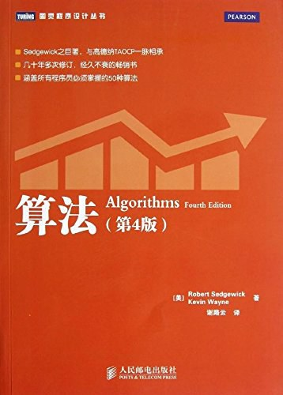

# algorithms_4th_reading_notes
# Algorithms 4th reading notes 
#《算法 第4版》笔记
# 1. 图书资源
图书主页：<https://algs4.cs.princeton.edu/home/>  
代码和数据：<https://algs4.cs.princeton.edu/code/>  
代码：<https://github.com/kevin-wayne/algs4.git>  
data（由于github上传文件大小限制，删除了几个大于50M的数据）: ./resources/algs4-data

# 2. 笔记
[第1章-基础](./notes/第1章-基础.md)  
[第2章-排序](./notes/第2章-排序.md)  
[第3章-查找](./notes/第3章-查找.md)  
[第4章-图](./notes/第4章-图.md)  
[第5章-字符串](./notes/第5章-字符串.md)  
[第6章-背景](./notes/第6章-背景.md)  

  

